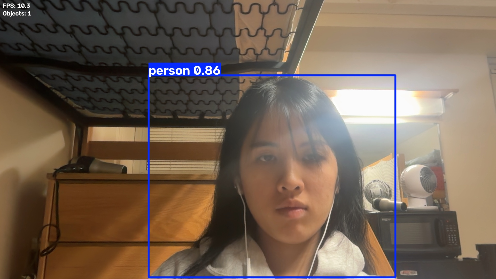

# Real-Time Object Detection with YOLOv8

A real-time computer vision application that detects and classifies objects from live webcam footage using **YOLOv8** and **OpenCV**.

The application processes camera frames in real time, displays bounding boxes and class predictions, measures inference FPS, counts detected objects, and allows annotated detection frames to be saved.

## Example Detection

Below is an example output from the real-time detection pipeline:



## Features

- Real-time webcam object detection
- YOLOv8 pretrained object detection
- Bounding boxes, class labels, and confidence scores
- Configurable confidence threshold
- Real-time FPS monitoring
- Detected-object count
- Configurable camera input
- Detection screenshot capture

## Technologies

- Python
- OpenCV
- Ultralytics YOLOv8

## Installation

Clone the repository:

```bash
git clone https://github.com/psleeyj/object-detection.git
cd object-detection
```

Install the required dependencies:

```bash
python3 -m pip install -r requirements.txt
```

YOLOv8 model weights are downloaded automatically by Ultralytics when the program is first run.

## Usage

Run real-time object detection:

```bash
python3 detect.py
```

Change the camera:

```bash
python3 detect.py --camera 1
```

Change the confidence threshold:

```bash
python3 detect.py --confidence 0.7
```

Or combine options:

```bash
python3 detect.py --camera 1 --confidence 0.6
```

## Controls

- `q` — quit the application
- `s` — save the current annotated detection frame

Saved images are stored in the `results/` directory.

## How It Works

The program continuously captures frames from a webcam using OpenCV and passes each frame through a pretrained YOLOv8 model.

The detection pipeline is:

**Webcam → OpenCV → YOLOv8 → Object Detection → Visualization**

For each frame, the program:

1. Captures an image from the webcam
2. Runs YOLOv8 inference
3. Detects and classifies visible objects
4. Draws bounding boxes and predictions
5. Calculates real-time FPS
6. Counts detected objects
7. Displays the annotated result

## Project Structure

```text
object-detection/
├── detect.py
├── requirements.txt
├── results/
└── README.md
```

## Future Improvements

Potential extensions include:

- Object tracking across video frames
- Class-specific filtering
- Video-file input
- Detection statistics
- Custom YOLO model training
- Performance benchmarking across YOLO model sizes
